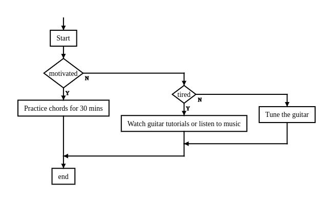

## Algorithmic Thinking and Flowcharts

### Overview
Algorithmic thinking involves breaking down complex problems into smaller, manageable steps to devise logical solutions. It is an essential skill for effective problem-solving and programming.

### Activity
Create a flowchart for a significant activity or goal you aim to accomplish. This visual tool will help you understand the sequence of steps and decision points involved. Use the example flowchart below as a reference:

### Further Reading
Learn more by exploring this [LinkedIn post on algorithmic thinking](https://www.linkedin.com/posts/iamgeekspe_algorithmic-thinking-is-the-process-involved-activity-7316471852946616320-FGCS?utm_source=share&utm_medium=member_desktop&rcm=ACoAAD8pjIMBdL2WNeD4z_asgy1kkUJaIJhrqzo&authuser=2).